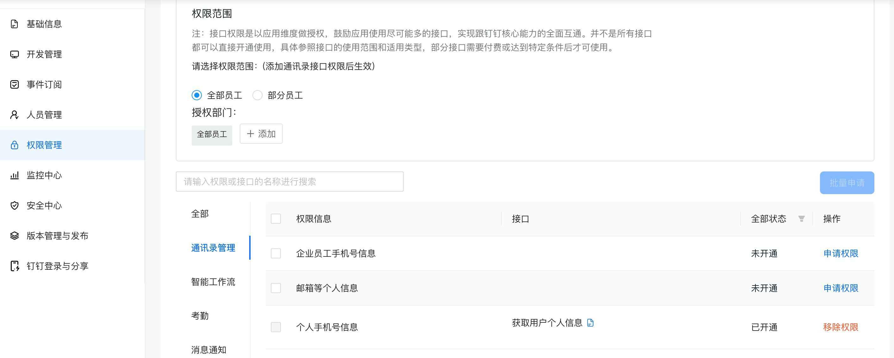

## h5app-auth-user-demo
> 钉钉用户授权获取用户信息，统一授权组件需要登陆[开发者后台](https://open-dev.dingtalk.com/)，申请**通讯录个人信息读权限**和**个人手机号信息**权限。
>
> **fronted**文件夹下是接入钉钉js-sdk，实现授权和取消授权功能获取authCode，之后使用npm run build打包，将打包好的静态资源放入backend子模块。
>
> **backend**子模块是用户授权后，使用authCode获取user_access_token,之后使用user_access_token获取用户信息功能，服务启动之后，可以在钉钉中访问服务(仅支持在钉钉中使用用户授权和取消授权功能)。

##### 申请个人手机号信息权限



##### 申请通讯录个人信息读取权限


## Getting Started


### 克隆代码仓库到本地
git clone
```
https://github.com/open-dingtalk/h5app-auth-user-demo.git
```

### 修改后端服务域名&clientId


### 使用命令行安装依赖&打包

```txt
cd fronted/
```


```txt
npm install
```


```txt
npm run build
```


### 将打包好的静态资源文件放入后端服务


### 替换应用配置


### 启动项目使用钉钉访问服务


### 参考文档

1. ##### 个人授权js-sdk唤起，文档链接：https://developers.dingtalk.com/document/app/features

2. ##### 获取用户个人access_token，文档链接：https://developers.dingtalk.com/document/app/obtain-user-token

3. ##### 获取个人用户信息，文档链接：https://developers.dingtalk.com/document/app/dingtalk-retrieve-user-information

4. ##### 服务商解除授权，文档链接：https://developers.dingtalk.com/document/app/instructions-for-use
